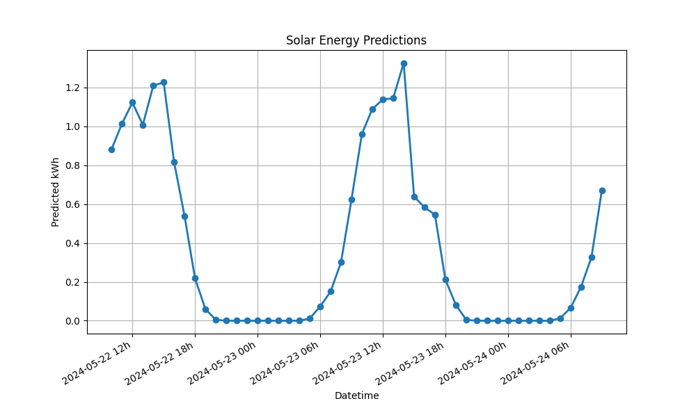

# Project Solar - Machine Learning

This project focuses on forecasting the energy yield of a household solar panel installation. The objective is to provide continuous predictions for the upcoming hours, enabling the owner to optimize energy consumption based on expected solar output (e.g., by scheduling appliance usage during high production periods).

## Data and Context

- **Energy Measurements:**  
  Hourly meter readings collected over one year from the solar panel system.

- **Weather Data:**  
  Historical observations including humidity, temperature, cloudiness, and pressure.

- **Sunrise and Sunset Times:**  
  Data detailing sunrise, true midday, and sunset times. These times are processed (converted into minutes) and integrated as additional features to enhance the prediction accuracy.

By combining these diverse data sources, the project builds a robust machine learning model that captures both technical performance and environmental influences.

## Executed Tasks

1. **Exploratory Data Analysis (EDA):**  
   - Analyzed time-series data to identify trends, seasonal effects, and anomalies.
   - Visualized patterns in energy yield and examined correlations with weather conditions.

2. **Data Preprocessing:**  
   - Cleaned and transformed datasets by converting timestamps, merging different data sources, and handling missing values.
   - Standardized and normalized features to improve model performance.

3. **Feature Engineering:**  
   - Extracted relevant features such as the hour of the day, sunrise, and sunset metrics.
   - Integrated weather variables to increase the predictive power of the model.

4. **Model Development and Evaluation:**  
   - Developed a machine learning model using historical data and evaluated its performance using Mean Absolute Error (MAE).
   - Split the data into training and test sets, trained the model, and generated future predictions based on forecast data.

## Repository Components

- **Jupyter Notebook (`140-project-solar-MatteoDeMoor.ipynb`):**  
  This notebook provides a detailed, step-by-step walkthrough of the project workflow, from data exploration and preprocessing to model training and evaluation.

- **Python Script (`140-project-solar-MatteoDeMoor.py`):**  
  This script automates the data loading, preprocessing, model training, and prediction processes, serving as a command-line alternative to the notebook.

## Author

**Matteo De Moor**
